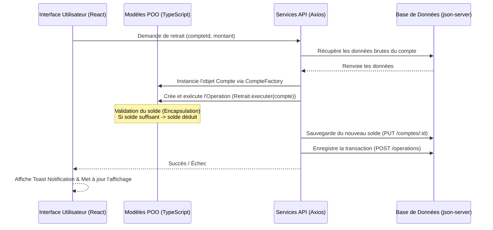

# 🏦 POO Bank - Gestionnaire Bancaire (TP POO L2)

Bienvenue dans **POO Bank**, une application Web moderne de simulation de gestion de comptes bancaires conçue pour illustrer les principes fondamentaux de la **Programmation Orientée Objet (POO)**.

Ce projet est développé avec **React**, **TypeScript**, **Tailwind CSS**, **daisyUI** pour l'interface graphique, et utilise **json-server** comme base de données locale fictive (Mock API).

---

## 📖 Sommaire

1. [🚀 Aperçu et Fonctionnalités](#-aperçu-et-fonctionnalités)
2. [🏗️ Architecture de l'Application](#️-architecture-de-lapplication)
3. [🧩 Les Concepts POO Appliqués (Expliqués en détail)](#-les-concepts-poo-appliqués-expliqués-en-détail)
   - [Encapsulation](#1-lencapsulation)
   - [Héritage](#2-lhéritage)
   - [Polymorphisme](#3-le-polymorphisme)
   - [Le Design Pattern Factory (Fabrique)](#4-le-design-pattern-factory-fabrique)
4. [📂 Structure du Code Source](#-structure-du-code-source)
5. [🔔 Le Système de Notifications (Toasts Globaux)](#-le-système-de-notifications-toasts-globaux)
6. [🛠️ Guide de Démarrage et Installation](#️-guide-de-démarrage-et-installation)

---

## 🚀 Aperçu et Fonctionnalités

**POO Bank** simule les opérations quotidiennes d'une agence bancaire à travers une interface visuelle épurée et interactive :

- **Création de Comptes** : Ouverture de comptes courants ou de comptes épargne dotés d'un taux d'intérêt spécifique.
- **Dépôts et Retraits** : Alimentation ou débit d'un compte avec validation en temps réel du solde.
- **Suivi des Transactions** : Enregistrement et affichage de l'historique complet de toutes les opérations de dépôt et de retrait classées par ordre chronologique.
- **Tableau de bord de synthèse** : Analyse de l'encours total de la banque, du nombre de comptes actifs, et des dernières activités.

---

## 🏗️ Architecture de l'Application

Pour comprendre comment le code s'exécute, imaginez l'application découpée en trois piliers :

1. **La Base de Données (Fichier [db.json](file:///media/work/Scripts/Github/Projet_POO_l2/db.json))** : Un simple fichier JSON qui agit comme une base de données. Il contient deux collections : `comptes` et `operations`.
2. **Le Serveur API (REST API via `json-server`)** : Une fausse API REST qui lit et écrit dans [db.json](file:///media/work/Scripts/Github/Projet_POO_l2/db.json). Elle permet au frontend de faire des requêtes HTTP standard (GET, POST, PUT, DELETE) sur `http://localhost:3001`.
3. **L'Interface Utilisateur (Frontend React & TypeScript)** : L'application web interactive qui communique avec le serveur API via le client HTTP **Axios**.

### Flux d'une opération de retrait



---

## 🧩 Les Concepts POO Appliqués (Expliqués en détail)

La Programmation Orientée Objet (POO) est une méthode de programmation consistant à structurer le code sous forme de "modèles" appelés **classes**, qui représentent des concepts du monde réel (ici, des comptes bancaires et des transactions).

### 1. L'Encapsulation

**Pour les débutants** : L'encapsulation consiste à cacher les données sensibles à l'intérieur d'un objet et à n'autoriser leur modification que par des méthodes sécurisées. C'est l'équivalent d'un distributeur automatique de billets : vous ne touchez pas directement aux liasses de billets à l'intérieur (les données privées), vous utilisez les boutons et l'écran (les méthodes publiques) pour obtenir l'argent de manière contrôlée.

**En pratique dans le projet** (Fichier [Compte.ts](file:///media/work/Scripts/Github/Projet_POO_l2/src/models/Compte.ts)) :

- Les attributs comme le solde (`_solde`), le numéro (`_numero`) et le propriétaire (`_proprietaire`) sont déclarés `private`. Ils ne peuvent pas être modifiés directement depuis l'extérieur.
- Nous utilisons des **Getters** et **Setters** pour y accéder en lecture/écriture.
- Les méthodes métier `deposer()` et `retirer()` appliquent des contrôles stricts de sécurité :

```typescript
// Extrait de Compte.ts
retirer(montant: number): void {
  if (montant <= 0) {
    throw new Error("Le montant à retirer doit être supérieur à zéro.");
  }
  if (this._solde < montant) {
    throw new Error("Solde insuffisant pour effectuer ce retrait."); // Protection contre le découvert non autorisé
  }
  this._solde -= montant; // Modification de la variable privée
}
```

### 2. L'Héritage

**Pour les débutants** : L'héritage permet de créer une nouvelle classe à partir d'une classe existante. La classe "enfant" hérite automatiquement de toutes les caractéristiques de la classe "parent", mais elle peut y ajouter ses propres particularités. C'est comme le concept générique de "Véhicule" dont découlent "Voiture" (avec un coffre) et "Moto" (avec un guidon).

**En pratique dans le projet** :

- La classe abstraite `Compte` est la classe parente.
- [CompteCourant.ts](file:///media/work/Scripts/Github/Projet_POO_l2/src/models/CompteCourant.ts) hérite de `Compte` sans attribut supplémentaire.
- [CompteEpargne.ts](file:///media/work/Scripts/Github/Projet_POO_l2/src/models/CompteEpargne.ts) hérite de `Compte` mais lui ajoute un attribut spécifique : le taux d'intérêt (`_tauxInteret`), indispensable pour faire fructifier l'épargne.

```typescript
// Extrait de CompteEpargne.ts
export class CompteEpargne extends Compte {
  private _tauxInteret: number; // Propre au compte épargne

  constructor(id: string, numero: string, proprietaire: string, solde: number, tauxInteret: number) {
    super(id, numero, proprietaire, solde); // Appel du constructeur de la classe parente Compte
    this._tauxInteret = tauxInteret;
  }
  
  // Getter et setter spécifiques au compte épargne
  get tauxInteret(): number { return this._tauxInteret; }
}
```

### 3. Le Polymorphisme

**Pour les débutants** : Le polymorphisme (littéralement "plusieurs formes") est la capacité pour différentes classes d'implémenter une même méthode de manières différentes. Imaginez un bouton rouge d'alimentation générale : si vous appuyez dessus dans une voiture, elle s'éteint ; si vous appuyez dessus sur une console de jeux, elle s'allume. L'action demandée est la même ("appuyer"), mais le résultat s'adapte à l'objet.

**En pratique dans le projet** (Fichiers [Operation.ts](file:///media/work/Scripts/Github/Projet_POO_l2/src/models/Operation.ts), [Depot.ts](file:///media/work/Scripts/Github/Projet_POO_l2/src/models/Depot.ts), [Retrait.ts](file:///media/work/Scripts/Github/Projet_POO_l2/src/models/Retrait.ts)) :

- La classe abstraite `Operation` définit une méthode abstraite `executer(compte: Compte): void`.
- Les classes filles `Depot` et `Retrait` héritent d' `Operation` et redéfinissent chacune cette méthode :
  - Pour un `Depot`, `executer` appelle `compte.deposer(montant)`.
  - Pour un `Retrait`, `executer` appelle `compte.retirer(montant)`.
- Le système appelle simplement `operation.executer(compte)` de façon générique sans avoir besoin de vérifier manuellement s'il s'agit d'un retrait ou d'un dépôt par des conditions complexes (`if`). Le langage décide dynamiquement quelle version de la méthode exécuter.

```typescript
// Dans Depot.ts
executer(compte: Compte): void {
  compte.deposer(this.montant);
}

// Dans Retrait.ts
executer(compte: Compte): void {
  compte.retirer(this.montant);
}
```

### 4. Le Design Pattern Factory (Fabrique)

**Pour les débutants** : Au lieu de créer manuellement des objets n'importe où dans notre code en faisant `new CompteCourant(...)` ou `new CompteEpargne(...)`, on délègue cette tâche à une "Usine" (Factory). On lui donne des données brutes, et elle s'occupe de fabriquer le bon type d'objet.

**En pratique dans le projet** (Fichier [CompteFactory.ts](file:///media/work/Scripts/Github/Projet_POO_l2/src/models/CompteFactory.ts)) :

- Lorsque le client HTTP reçoit les données brutes JSON de l'API, `CompteFactory.create(data)` décide automatiquement quelle classe instancier selon la valeur du champ `type` :

```typescript
// Extrait de CompteFactory.ts
export class CompteFactory {
  static create(data: any): Compte {
    if (data.type === 'courant') {
      return new CompteCourant(data.id, data.numero, data.proprietaire, data.solde);
    } else if (data.type === 'epargne') {
      return new CompteEpargne(data.id, data.numero, data.proprietaire, data.solde, data.tauxInteret);
    }
    throw new Error(`Type de compte inconnu: ${data.type}`);
  }
}
```

---

## 📂 Structure du Code Source

Voici l'organisation générale des fichiers du projet :

```bash
.
├── db.json                 # Base de données locale (générée automatiquement si absente)
├── start-server.js         # Script Node.js de lancement et vérification de la base de données (pop-up)
├── package.json            # Configuration npm, scripts et dépendances du projet
└── src/
    ├── main.tsx                # Point d'entrée de l'application React
    ├── App.tsx                 # Routeur principal et structure globale du site
    ├── App.css & index.css     # Styles globaux (Tailwind CSS v4 & DaisyUI)
    │
├── models/                 # Modèles de données POO (Classes métiers)
│   ├── Compte.ts           # Classe abstraite de base d'un compte
│   ├── CompteCourant.ts    # Sous-classe Compte Courant
│   ├── CompteEpargne.ts    # Sous-classe Compte Épargne (avec taux)
│   ├── CompteFactory.ts    # Fabrique d'objets Compte
│   ├── Operation.ts        # Classe abstraite d'une transaction
│   ├── Depot.ts            # Sous-classe de Dépôt d'argent
│   ├── Retrait.ts          # Sous-classe de Retrait d'argent
│   └── OperationFactory.ts # Fabrique d'objets Opération
│
├── services/               # Services API pour communiquer avec le serveur
│   ├── compteService.ts    # Gestion des requêtes HTTP pour les comptes
│   └── operationService.ts # Gestion des requêtes HTTP pour les opérations
│
├── components/             # Composants d'interface réutilisables
│   ├── Toast.tsx           # Context & Composant d'affichage des notifications Toast
│   ├── ListeComptes.tsx    # Tableau affichant la liste des comptes
│   ├── CompteForm.tsx      # Formulaire de création de compte
│   ├── DepotForm.tsx       # Formulaire de dépôt d'argent
│   ├── RetraitForm.tsx     # Formulaire de retrait d'argent
│   └── HistoriqueOperations.tsx # Liste de l'historique des opérations
│
└── pages/                  # Pages principales de l'application
    ├── Dashboard.tsx       # Tableau de bord général (synthèse et statistiques)
    └── Comptes.tsx         # Page de gestion des comptes et des transactions
```

---

## 🔔 Le Système de Notifications (Toasts Globaux)

Toutes les notifications d'erreur, de succès et d'information de l'application sont gérées à l'aide d'un système de **Toast** centralisé implémenté dans le fichier [Toast.tsx](file:///media/work/Scripts/Github/Projet_POO_l2/src/components/Toast.tsx).

### Pourquoi ce choix ?

Auparavant, les erreurs et les messages de réussite étaient soit ignorés, soit affichés par de simples alertes de navigateur bloquantes (`alert()`), ou via des bannières locales qui déformaient la structure des formulaires.
Le système de Toast fournit :

- Une **meilleure expérience utilisateur** (UX) : les notifications apparaissent sous forme de jolies bulles colorées flottant en bas à droite de l'écran.
- Un **système non-bloquant** : les bulles disparaissent automatiquement après 4 secondes sans perturber le flux de travail de l'utilisateur.
- Un **code centralisé** : Grâce à l'utilisation du **React Context API**, n'importe quel composant de l'application peut déclencher un message de notification en faisant simplement appel au hook personnalisé `useToast()` :

```typescript
// Exemple d'utilisation dans n'importe quel composant
import { useToast } from './Toast';

const MonComposant = () => {
  const { showToast } = useToast();
  
  const executerAction = () => {
    try {
      // Action réussie
      showToast("Opération effectuée avec succès !", "success");
    } catch (error) {
      // Échec de l'action
      showToast("Échec : " + error.message, "error");
    }
  };
}
```

---

## 🛠️ Guide de Démarrage et Installation

### Prérequis

- **Node.js** (version 18 ou supérieure)
- **npm** (inclus avec Node.js)

### 1. Installation des dépendances

Ouvrez votre terminal dans le dossier racine du projet et exécutez la commande suivante :

```bash
npm install
```

### 2. Démarrer le serveur de données (json-server)

Pour simuler la base de données, lancez le serveur fictif sur le port 3001 :

```bash
npm run server
```

> [!NOTE]
> **Création automatique de `db.json`** : Si le fichier `db.json` est introuvable (par exemple lors de la première installation ou après suppression), le script `start-server.js` s'exécute pour vérifier sa présence. Il tente alors d'ouvrir un pop-up graphique sur votre bureau (via `/usr/bin/zenity`) pour vous proposer de le recréer automatiquement avec des données de démonstration. Si vous refusez ou si vous lancez la commande en mode console pur (sans écran graphique), le script vous posera directement la question dans votre terminal.

*Le serveur tourne désormais à l'adresse : `http://localhost:3001`.*

### 3. Démarrer l'application Web (Vite dev)

Dans un deuxième terminal, lancez le serveur de développement de l'interface utilisateur :

```bash
npm run dev
```

Ouvrez votre navigateur sur le lien indiqué dans la console (généralement `http://localhost:5173` ou `http://localhost:5174`).

### 4. Compiler l'application pour la production

Pour tester la compilation TypeScript et générer les fichiers optimisés pour la mise en ligne (dans le dossier `/dist`) :

```bash
npm run build
```
